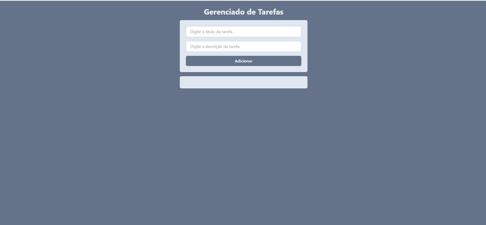

# Projeto React Initial - Gerenciador de tarefas

Este é um projeto inicial em React criado para fins de estudo e experimentação com componentes, hooks e roteamento.

✅ Funcionalidades
Criação e listagem de tarefas

Roteamento entre páginas

Estilização com Tailwind (se aplicável)


## 🧪 Tecnologias Utilizadas

- [React](https://reactjs.org/)
- [Vite](https://vitejs.dev/)
- [React Router DOM](https://reactrouter.com/)
- [Tailwind CSS](https://tailwindcss.com/) (se estiver usando)
- [ESLint](https://eslint.org/) (opcional)
- HTML
- Javascript

## 🚀 Começando

Siga os passos abaixo para rodar o projeto localmente.

### Pré-requisitos

- Node.js (versão recomendada: 18+)
- npm ou yarn
- Git

### Instalação

```bash
# Clone o repositório
git clone https://github.com/andredantasti/projeto-react-initial.git

# Acesse a pasta do projeto
cd projeto-react-initial

# Instale as dependências
npm install
# ou
yarn


## 🔗 Demo Online

👉 [Clique aqui para ver o projeto funcionando](https://projeto-react-initial.vercel.app/)
Repositório GITHUB - (https://github.com/andredantasti/projeto-react-initial)

---

## 🎞️ Preview (GIF Demonstrativo)

### Screenshot



---

## ⚙️ Tecnologias Utilizadas

- HTML5
- CSS3 (Responsivo / Mobile First)
- JavaScript
- React + Vite
- TailwindCSS
- Git & GitHub - Repositório
- Vercel (para deploy)

---

## 🧠 Aprendizados
- Manipulação de dados via fetch() com JSON

- Separação de lógica em múltiplos arquivos JS

- Estilização responsiva com media queries

- Publicação no repositório GitHub

- deploy no Vercel

🙋‍♂️ Contribuindo
Sinta-se à vontade para abrir issues ou enviar pull requests com melhorias!

## Author

- GitHub - [andredantasti](https://github.com/andredantasti)
- Frontend Mentor - [@andredantati](https://www.frontendmentor.io/profile/andredantasti)
- Linkedin - [Andre Dantas](https://www.linkedin.com/in/andre-dantas-84b370366/)

📁 Estrutura do Projeto

src/
├── components/       # Componentes reutilizáveis
├── pages/            # Páginas principais (com rotas)
├── App.jsx           # Componente principal com o roteamento
├── main.jsx          # Ponto de entrada da aplicação
├── index.css         # Estilos globais


